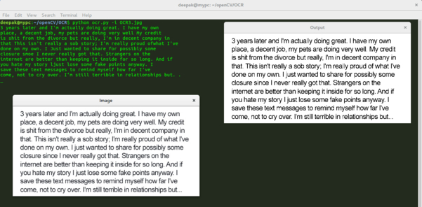
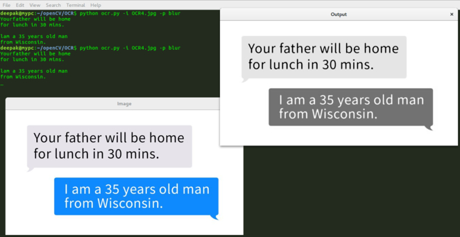

# OCR-Text
  Optical Character Recognition using Google's Tesseract engine

## Learn open cv from [openCV documentation](https://docs.opencv.org/3.2.0/d9/df8/tutorial_root.html)

## Learn more about Tesseract [here](https://github.com/tesseract-ocr/tesseract)

### trans_color function 
  
  1. Load the example image and convert it to grayscale
  
  2. Check preprocess to apply thresholding on the image
  
  3. Load the image as a PIL/Pillow image
  
  4. Additional processing such as spellchecking for OCR errors or NLP should be applied
  
## In order to run this script
  
  1. Open terminal
  2. Run command in this sequence : 
  <code>$ python ocr.py -image image.jpg</code>
         
  (Applying Gaussian Blur/Thresholding)
  <code>$ python ocr.py -image image.jpg -preprocess blur</code>
  
#### OUTPUT
  
  
#### OUTPUT  
  
  
  
  
